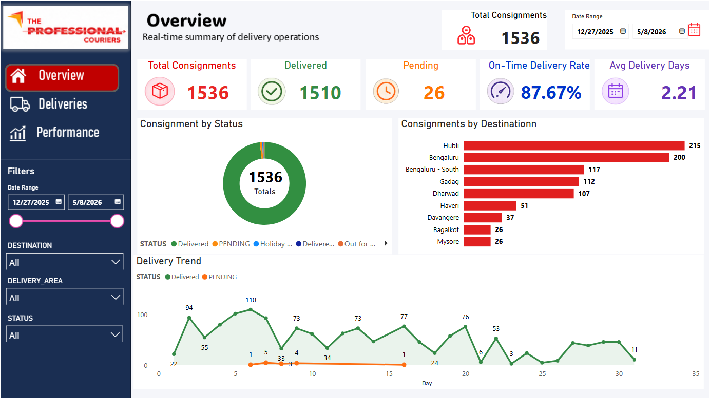
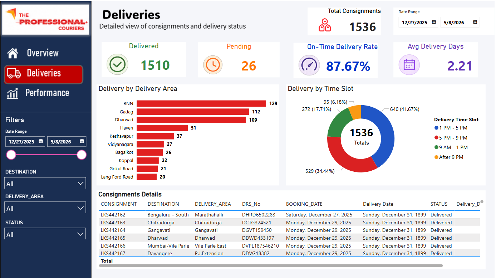
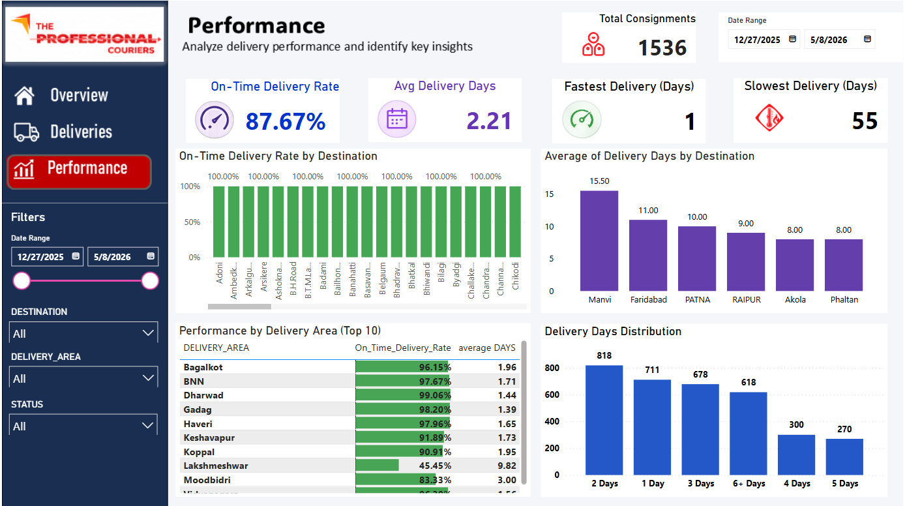

# 🚚 TPC Logistics & Delivery Analytics Dashboard

An interactive Power BI dashboard project built to analyze and monitor courier delivery operations, shipment performance, and logistics efficiency.

The dashboard transforms raw logistics data into meaningful business insights through dynamic visualizations and KPI tracking.

---

# 📌 Project Objectives

This project helps in:

- Tracking delivery performance
- Monitoring shipment status
- Measuring on-time delivery efficiency
- Identifying delayed delivery areas
- Analyzing destination-wise shipment trends
- Improving operational decision-making

---

# 📊 Dashboard Pages

## 🏠 Overview Dashboard

The Overview page provides a quick summary of logistics operations and overall delivery performance.

### Key Features:
- Total Shipments
- Delivered vs Pending Orders
- On-Time Delivery %
- Average Delivery Days
- Shipment Trend Analysis
- Destination Insights

---

## 🚛 Deliveries Dashboard

This dashboard focuses on detailed shipment-level analysis and operational tracking.

### Includes:
- Delivery Area Analysis
- Shipment Tracking Table
- Delivery Time Analysis
- Interactive Filtering
- Destination Performance

---

## ⚡ Performance Dashboard

The Performance page evaluates operational efficiency and delivery speed.

### Insights Covered:
- Fastest Deliveries
- Slowest Deliveries
- On-Time vs Delayed Deliveries
- Area-wise Performance Metrics
- Delivery Days Distribution

---

# 🛠️ Tools & Technologies

- Power BI
- Power Query
- DAX
- Excel / CSV Data
- Data Visualization Techniques

---

# 📈 Project KPIs

| KPI | Value |
|---|---|
| Total Consignments | 1536 |
| Delivered Shipments | 1510 |
| Pending Deliveries | 26 |
| On-Time Delivery Rate | 87.67% |
| Average Delivery Days | 2.21 |

---

# 🔍 Key Insights

- Most consignments were delivered successfully with a high completion rate.
- Deliveries between 1–3 days accounted for the majority of shipments.
- Bengaluru and Hubli recorded the highest delivery volumes.
- Some delivery areas experienced repeated delays.
- Overall operational efficiency remained strong.

---

# 📚 Skills Applied

This project demonstrates:

- Data Cleaning
- Data Transformation
- DAX Measures
- KPI Development
- Dashboard Designing
- Business Analysis
- Data Storytelling
- Logistics Analytics

---

# 🚀 Future Improvements

Planned future enhancements include:

- Real-Time Data Integration
- Predictive Delivery Analysis
- Interactive Geo Maps
- Delay Reason Tracking
- Customer Satisfaction Analysis

---

# 📷 Dashboard Preview

## Overview Dashboard

---

## Deliveries Dashboard

---

## Performance Dashboard

---

# 👨‍💻 Author

## Pavan Rajoli

📧 Email: pavanrajoli@gmail.com

Aspiring Data Analyst skilled in:
- SQL
- Python
- Power BI
- Excel

---

# 🔗 Project Links

## 📊 Power BI Dashboard
[View Dashboard](https://app.powerbi.com/view?r=eyJrIjoiOTU5NTA2OTItNWNkMS00MjI4LTkxZDktYjA2ZjgyNDVmZjk4IiwidCI6ImEyNGY0OWI3LTM3YjEtNGVmZi1iMmZiLTA5OTI5M2E0ZDBjZSJ9)

---

## 💻 GitHub Repository
[GitHub Repository](https://github.com/PavanRajoli/The-Professional-Couriers/blob/main/README.md)

---

## 🌐 LinkedIn Post
[LinkedIn Project Post](https://www.linkedin.com/posts/pavan-rajoli_powerbi-dataanalytics-dataanalyst-ugcPost-7462181784357744640-IuDD?utm_source=share&utm_medium=member_desktop&rcm=ACoAADGgvhMBwoVzueJjzz2qcMp_muPWBJep8QE)

---

# ⭐ Feedback

Feedback and suggestions are always welcome!
